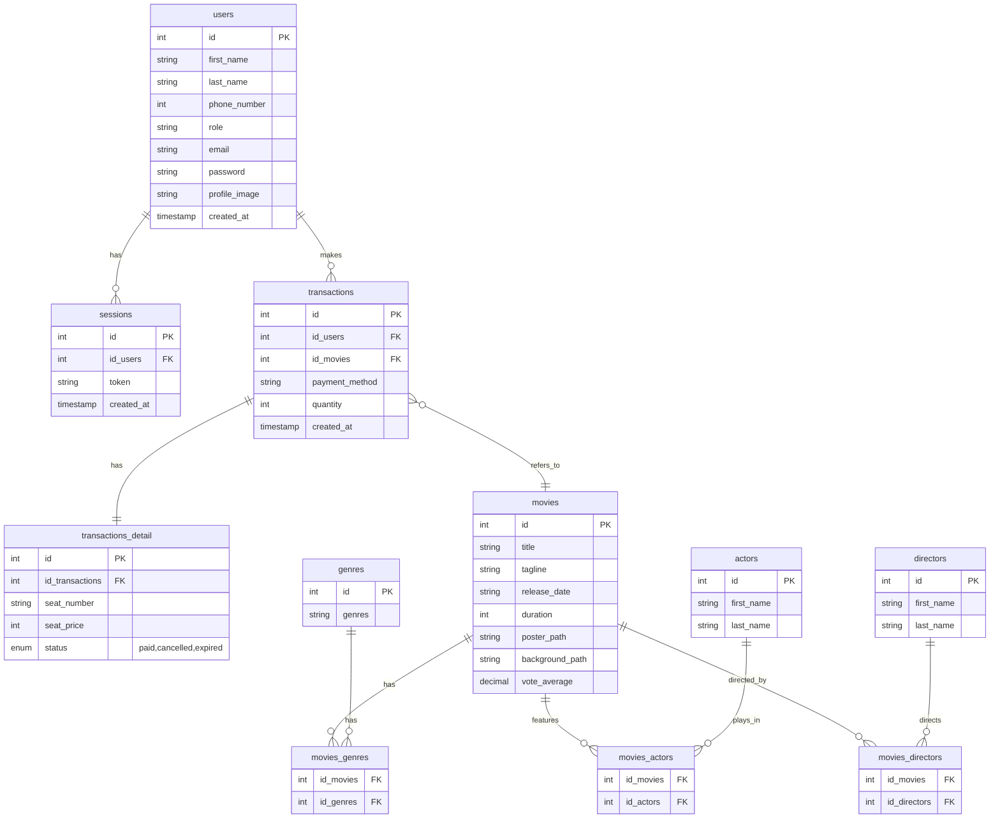

## 🎬 Movie Ticket Booking App

A full-featured web application for booking movie tickets. Users can register, browse movies, select schedules, choose seats, and make payments online.

```mermaid

erDiagram

users ||--o{ sessions : has
users ||--o{ transactions : makes
transactions ||--|| transactions_detail : has

transactions }o--|| movies : refers_to

movies ||--o{ movies_genres : has
genres ||--o{ movies_genres : has

movies ||--o{ movies_actors : features
actors ||--o{ movies_actors : plays_in

movies ||--o{ movies_directors : directed_by
directors ||--o{ movies_directors : directs

users {
    int         id           PK
    string      first_name
    string      last_name
    int         phone_number
    string      role
    string      email
    string      password
    string      profile_image
    timestamp   created_at
}

sessions {
    int         id          PK
    int         id_users    FK
    string      token
    timestamp   created_at
}

movies {
    int         id              PK
    string      title
    string      tagline
    string      release_date
    int         duration
    string      poster_path
    string      background_path
    decimal     vote_average
}

genres {
    int     id      PK
    string  genres
}

movies_genres {
    int     id_movies   FK
    int     id_genres   FK
}

actors {
    int     id          PK
    string  first_name
    string  last_name
}

movies_actors {
    int     id_movies   FK
    int     id_actors   FK
}

directors {
    int     id          PK
    string  first_name
    string  last_name
}

movies_directors {
    int     id_movies       FK
    int     id_directors    FK
}

transactions {
    int         id              PK
    int         id_users        FK
    int         id_movies       FK
    string      payment_method
    int         quantity
    timestamp   created_at
}

transactions_detail {
    int     id                  PK
    int     id_transactions     FK
    string  seat_number
    int     seat_price
    enum  status        "paid,cancelled,expired"
}


```
